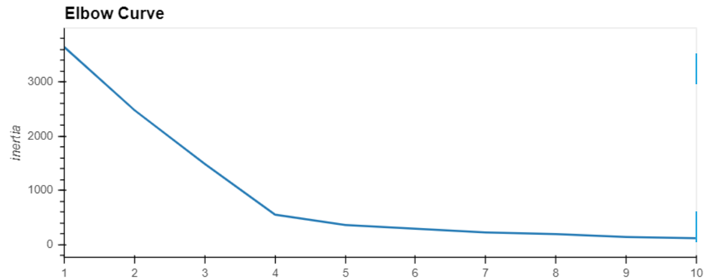

# Cryptocurrencies

## Project Overview

A prominent investment bank is interested in offering a new cryptocurrencies investment portfolio for its customers. This company is lost in the immense universe of cryptocurrencies.  For this module, one needs to present a report of what cryptocurrencies are on the trading market and how cryptocurrencies could be grouped toward creating a classification for developing this new investment product.

The data is not ideal, so it will be processed to fit the machine learning models. Since there is no known output, unsupervised learning will be used. A clustering algorithm  will be used to group the cryptocurrencies to help determine about investing in this product. Use data visualizations to share findings with the board.

## Objectives

The goals for this challenge:

    1. Prepare the data for dimensions reduction with PCA and clustering using K-means.
    2. Reduce data dimensions using PCA algorithms from sklearn.
    3. Predict clusters using cryptocurrencies data using the K-means algorithm form sklearn.
    4. Create some plots and data tables to present your results.
    
## Resources

Data Source: crypto_data.csv Software: Python 3.7.6, Anaconda 4.8.4, Jupyter Notebook 6.0.3, image source: https://robbreport.com/lifestyle/news/why-now-is-the-best-time-to-invest-in-cryptocurrencies-2898743/

## Challenge Overview

### Data Preprocessing
Start by loading the data in a Pandas DataFrame named “crypto_df.” Continue with the following data preprocessing tasks:

    1. Remove all cryptocurrencies that aren’t trading.
    2. Remove all cryptocurrencies that don’t have an algorithm defined.
    3. Remove the IsTrading column.
    4. Remove all cryptocurrencies with at least one null value.
    5. Remove all cryptocurrencies without coins mined.
    6. Store the names of all cryptocurrencies on a DataFramed named coins_name, and use the crypto_df.index as the index for this new DataFrame.
    7. Remove the CoinName column.
    8. Create dummies variables for all of the text features, and store the resulting data on a DataFrame named X.
    9. Use the StandardScaler from sklearn (Links to an external site.) to standardize all of the data from the X DataFrame. Remember, this is important prior to using PCA and K-means algorithms.
    
### Reducing Data Dimensions Using PCA

    1. Use the PCA algorithm from sklearn (Links to an external site.) to reduce the dimensions of the X DataFrame down to three principal components.

    2. Once you have reduced the data dimensions, create a DataFrame named “pcs_df” that includes the following columns: PC 1, PC 2, and PC 3. Use the crypto_df.index as the index for this new DataFrame.
    

    
### Clustering Cryptocurrencies Using K-means

    1. Create an elbow curve to find the best value for K, and use the pcs_df DataFrame.
    2. Once you define the best value for K, run the K-means algorithm to predict the K clusters for the cryptocurrencies’ data. Use the pcs_df to run the K-means algorithm.
    3. Create a new DataFrame named “clustered_df,” that includes the following columns: Algorithm, ProofType, TotalCoinsMined, TotalCoinSupply, PC 1, PC 2, PC 3, CoinName, and Class. 
    
Before I could use the clustering KMeans algorithm from sklearn, I had to create an elbow curve to find out the optimal value for K.  Elbow curve turned out showing that the most drastical corner is at the point 4.

I ran the K-means algorithm on the dataset to predict 4 cluster for cryptocurrencies' data.  I created a summary DataFrame containing Cryptocurrencies' parameters, PCA dimensions, and predicted cluster numbers stored in a column "class".

### Visualizing Results

    1. Create a 3D scatter plot using Plotly Express to plot the clusters using the clustered_df DataFrame. You should include the following parameters on the plot: hover_name="CoinName" and hover_data=["Algorithm"] to show this additional info on each data point.
    2. Use hvplot.table to create a data table with all the current tradable cryptocurrencies. The table should have the following columns: CoinName, Algorithm, ProofType, TotalCoinSupply, TotalCoinsMined, and Class.
    3. Create a scatter plot using hvplot.scatter to present the clustered data about cryptocurrencies having x="TotalCoinsMined" and y="TotalCoinSupply" to contrast the number of available coins versus the total number of mined coins. Use the hover_cols=["CoinName"] parameter to include the cryptocurrency name on each data point.

To visualize the clusters of the cryptocurrencies I created a 3D scatter plot:

Then I created a data table with all the currently tradeble cryptocurrencies using hvplot library:

I created a scatter plot using hvplot.scatter to present the clustered data about cryptocurrencies having x="TotalCoinsMined" and y="TotalCoinsSupply" to constrast the number of available coins versus the total number of mined coins using hvplot library as well.

